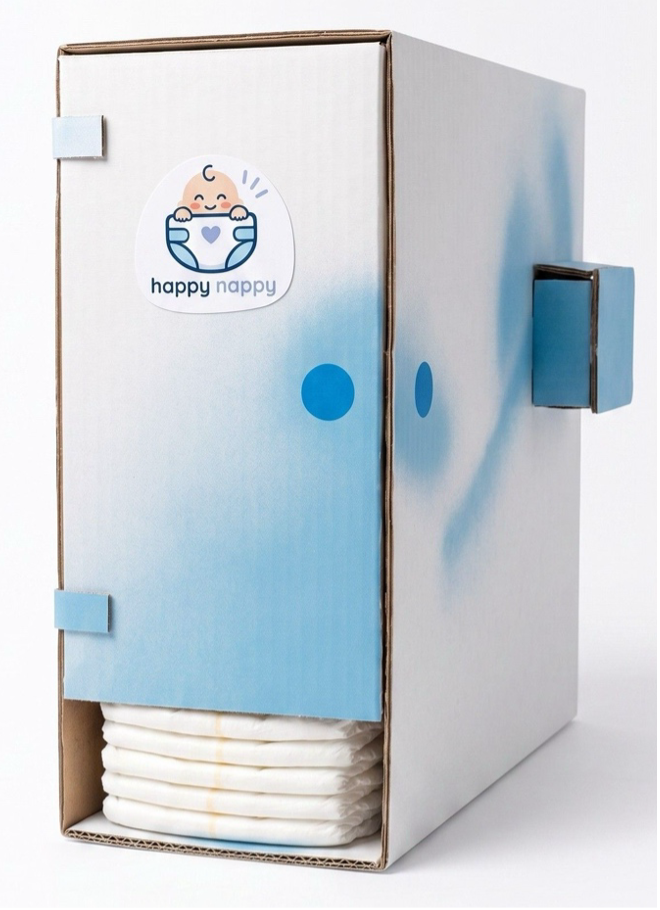
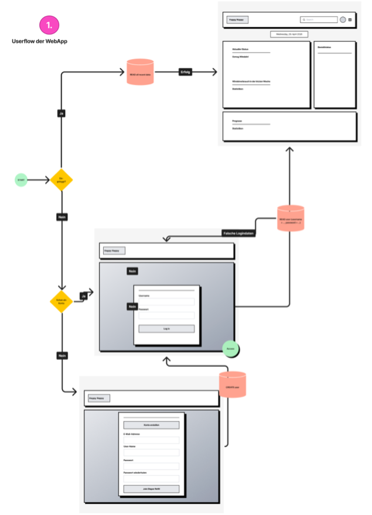
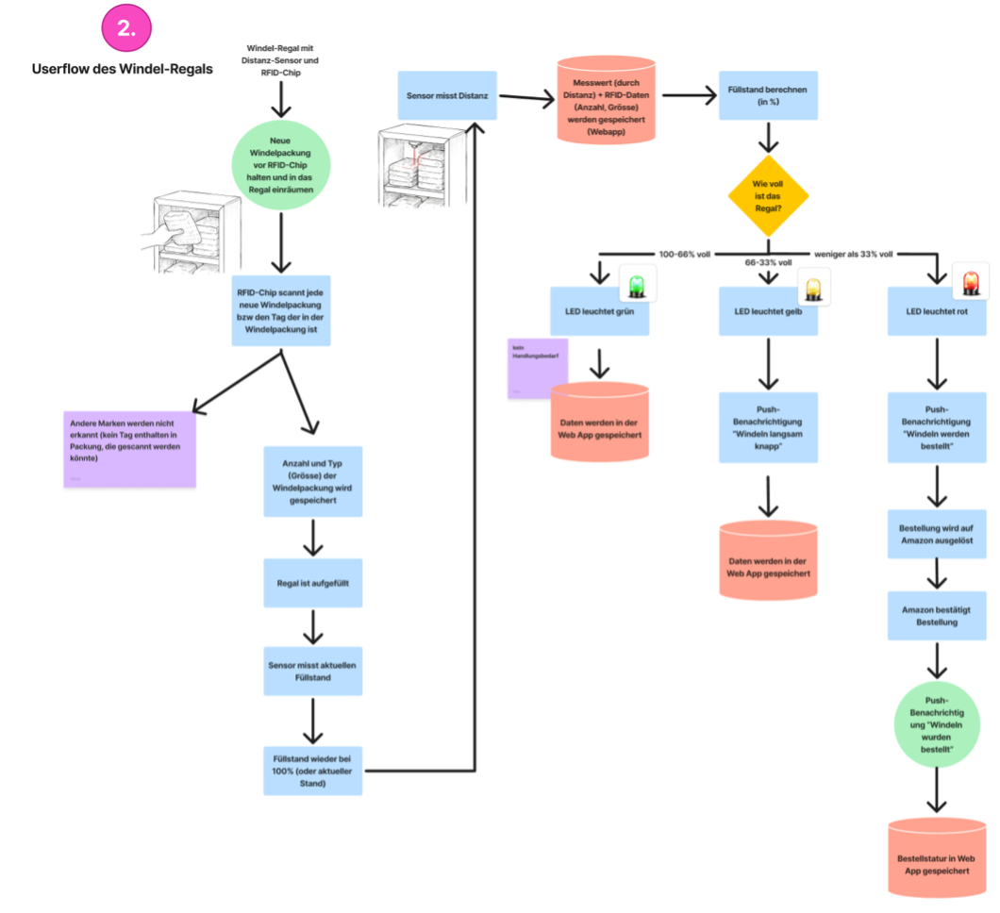
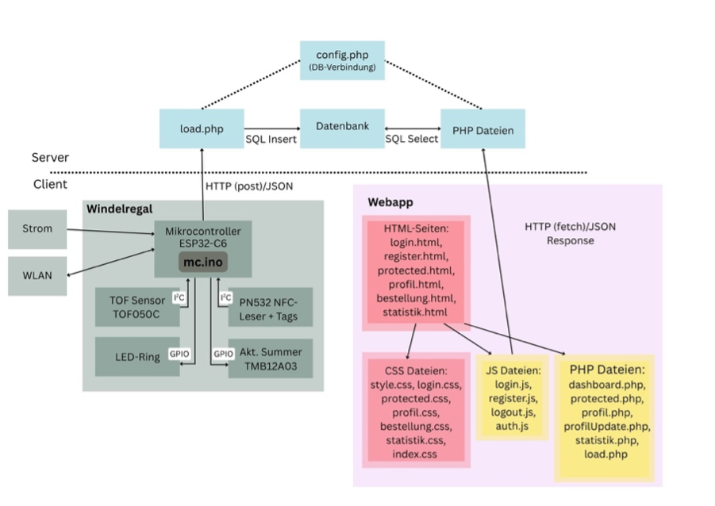
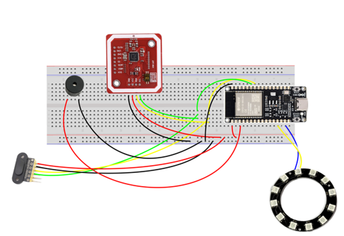
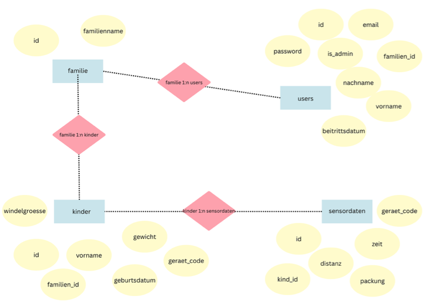

## Kurzbeschreibung des Projekts

* **Modul:** Interaktive Medien 4 an der Fachhochschule Graubünden (FS26)  
* **Themenfeld:** IoT-Applikation zum Thema Eltern mit kleinen Kindern  
* **Name des Projekts:** \[*Happynappy*\]   
* **Team Physical Computing:** \[*Eliane Gerber*\*Katja Saxer*]   
* **Team WebApp:** \[*Gianna Mohler*\*Vianne Häfeli*]
 
 
* Welches Problem im Alltag von Eltern mit kleinen Kindern wird gelöst? 
Eltern müssen sich keine Gedanken oder Sorgen machen, dass ihnen die Windeln ausgehen könnten. Eltern von Babys haben sowieso schon viel Stress, wenig Zeit und keinen Nerv sich noch um Dinge, wie "wann muss ich wieder Windeln kaufen” zu sorgen. Obwohl sie vielleicht sehen, dass es nicht mehr viele Windeln hat, vergisst man dies schnell wieder während dem Wickeln. Man kann nicht ewig daran denken, wenn man gerade alle Hände voll zu tun hat.

* Was ist der „Sinn und Zweck“ des Systems?
Das System rund um die Sensoren im Windelregal überwacht automatisch den Windelvorrat, informiert Eltern jederzeit über den aktuellen Bestand und löst bei Bedarf eine Nachbestellung aus. Alle Daten werden in einer Web-App gespeichert und angezeigt.

### UX & Konzeption

*In diesem Teil werden die gemeinsamen Schritte aus der UX-Abgabe dokumentiert, damit sich hier alles vollständig an einem Ort befindet (betrifft WebApp und Physical Computing)*

* **Figma:** https://www.figma.com/design/qEmU0QUahOy69AkJDQ29R0/IM-4-%E2%80%93-App-Konzeption-Windel?node-id=78-325&t=buP31gAMcBGWu9rx-1 
* **User Flow \+ Screen Flow** (Screenshot aus Figma)  

* *Welche Features waren angedacht?*
Physical Computing:
•	Distanzmessung
•	LED-Ring mit Lichtstufen (grün-rot)
•	RFID-Sensor

Kam neu dazu:
•	RFID mit Summer (Beep-Ton), wenn er gescannt hat

Webapp:
•	Aktueller Windelbestand
•	Statistik: Verlauf des Windelbestandes in letzter Zeit und Prognose für den Windelverbauch
•	Automatische Bestellung auslösen

Kam neu dazu: 
•	Mehrere Kinder können eingefügt werden
•	mehrere User können einer Familie beitreten und dann die Daten derselben Kinder sehen

* *Welche Features wurden nicht umgesetzt? (Warum)*
Physical Computing: nichts
Webapp: Wenn der Windelbestand knapp wird, erhalten Eltern keine Nachricht aufs Handy. Bestand ist einfach in der App einsehbar. Dies haben wir nach Besprechung mit einem Dozenten weggelassen.

### Setup

* **WebApp:** https://happynappy.vianne-haefeli.ch/login.html 
* **Video-Dokumentation:** https://youtu.be/X3x6wYuGR2Y 

#### Installationsanleitung WebApp

***verständliche** Schritt-für-Schritt-Anleitung für Aussenstehende, um das Projekt zu klonen und auf einem eigenen Server zu installieren*

1. *Was benötige ich an Infrastruktur?*
•	Rechner/Laptop mit Internetzugang für Uploads und Datenbankverwaltung
•	Webhosting bei Infomaniak
•	MySQL-Datenbank (direkt über Infomaniak erstellt)
•	FTP-Zugang zum Webserver
•	Visual Studio Code als Code Editor
•	GitHub-Repository zum Sharen des Codes

2. *Was muss ich auf meinem Webserver installieren?*
•	PHP
•	MySQL-Datenbank
•	Projektdateien
•	Konfigurationsdatei config.php mit den Datenbankzugangsdaten

3. *Wie kann ich die Datenbank importieren?* 
•	Infomaniak > Website anklicken > Datenbanken > Datenbank hinzufügen. Anmeldung über phpMyAdmin. 
•	Im config.php die Verbindungsdaten eintragen: Host, Namen der DB, User sowie das Passwort.
 
4. *Wo muss ich die DB-Credentials eintragen?*  
Ins config.php. Es ist wichtig, dass diese Daten nicht auf GitHub landen, da sonst jeder darauf zugreifen könnte und die Website hacken könnte. Deshalb die Datei ins .gitignore schreiben.
5. *…*  
6. *Wie nehme ich das physische Artefakt in Betrieb?*
Das physische Artefakt besitzt einen individuellen Gerätecode.
Beim Hinzufügen eines Kindes auf der Profilseite kann dieser Gerätecode eingetragen werden. Dadurch wird das physische Regal mit dem entsprechenden Kind in der Datenbank verknüpft.
Sobald eine neue Windelpackung erhalten wird, kann diese über den Scanner an der Seite des Regals erfasst werden. Nach dem Scannen werden die Windeln von vorne in das Regal eingefüllt. Dabei wird der Windelbestand automatisch in der App aktualisiert und dem entsprechenden Kind zugeordnet.
Benötigt man eine Windel, kann diese bequem über die vordere Entnahmeöffnung des Regals herausgezogen werden. Die Sensoren erkennen die Entnahme und passen den Bestand in der App automatisch an.
Die Sensordaten werden anschliessend automatisch dem richtigen Kind zugeordnet und in den Tabellen “kinder” und “sensordaten” gespeichert. Dadurch kann für jedes Kind der passende Windelbestand angezeigt werden.
 

#### Bauanleitung Physical Computing

* ***Was muss ich wie bauen, verbinden, installieren?***  
Verwendete Komponenten:
ESP32-C6	Microcontroller
TOF Sensor TOF050C VL6180X	Misst den Füllstand des Windelregals
PN532 NFC/RFID-Leser	Erkennt Windelpackungen über RFID-Tags
RFID-Tag	In jeder Windelpackung von HappyNappy integriert
WS2812B LED-Ring 	Zeigt den Füllstand optisch an
Aktiver Summer TMB12A03	Akustische Bestätigung beim RFID-Scan
WLAN	Übertragung der Sensordaten
Strom	Stromversorgung
Webserver/Datenbank	Speicherung und Auswertung der Daten

Verbindungen:
GPIO	Verbindung zwischen ESP32, LED-Ring und Buzzer
I²C	Kommunikation mit Distanzsensor und RFID-Leser
WLAN	Verbindung des ESP32 mit dem Webserver
HTTP (POST)	Überträgt JSON-Daten an den Server
SQL (MySQL)	Speicherung der Daten in der Datenbank

Installation:
•	Arduino IDE installieren. 
•	ESP32 Board-Paket installieren. 
•	Folgende Bibliotheken installieren: 
o	FastLED 
o	Adafruit VL6180X 
o	Adafruit PN532 
o	Arduino_JSON 
o	WiFi 
o	HTTPClient 
•	Programm auf den ESP32-C6 laden. 
•	WLAN-Zugangsdaten im Code eintragen. 
•	Webserver-URL konfigurieren. 
•	System starten.

So funktionierts:
•	Der RFID-Leser erkennt eine neue Windelpackung. 
•	Die UID des RFID-Tags wird ausgelesen. 
•	Der Distanzsensor misst den aktuellen Füllstand. 
•	Der LED-Ring zeigt den Füllstand an: 
o	Grün = 66–100 % 
o	Gelb = 33–66 % 
o	Rot = 0–33 % 
•	Die Daten werden per WLAN an den Webserver gesendet. 
•	Die Web-App speichert und visualisiert die Daten. 
•	Bei niedrigem Bestand werden Benachrichtigungen und Nachbestellungen ausgelöst.

**Komponentenplan** 

 
Die Komponenten sind in Hardware, Kommunikationsprotokolle und Software gegliedert. Der ESP32-C6 liest die Daten des Distanzsensors und des RFID-Lesers aus und sendet diese über WLAN an den Server. Die Daten werden in einer Datenbank gespeichert und anschliessend in der Web-App visualisiert. Über die Web-App können Eltern den aktuellen Windelbestand sowie den Verbrauch einsehen. Bei niedrigem Bestand werden automatisch neue Windeln nachbestellt.

**Steckplan** 

Die folgende Übersicht zeigt die wichtigsten Komponenten der WebApp sowie deren jeweilige Funktionen. Dabei werden sowohl Frontend-Dateien für Darstellung und Benutzeroberfläche als auch Backend-Dateien für Datenverarbeitung, Datenbankzugriffe und die Kommunikation mit dem physischen Artefakt berücksichtigt.

Komponente	Funktion
login.html, register.html, protected.html, profil.html, bestellung.html, statistik.html	- Aufbau der verschiedenen Seiten der WebApp
- Navigation zwischen den Bereichen
- Darstellung von Bestand, Profil, Bestellung und Statistik
style.css, login.css, protected.css, profil.css, bestellung.css, statistik.css, index.css	- Design und Layout der verschiedenen Seiten
- Mobile-First-Darstellung
- Farben, Schriftarten, Abstände und Responsive Design
login.js, register.js, logout.js, auth.js	- Benutzeranmeldung und Registrierung
- Session-Verwaltung
- Logout-Funktion
protected.js, profil.js, bestellung.js, statistik.js	- Laden und Verarbeiten von Daten
- Berechnung von Windelbestand und Bestellungen
- Darstellung von Diagrammen und Statistiken
dashboard.php, protected.php, profil.php, profilUpdate.php, statistik.php, load.php	- Verarbeitung von API-Anfragen
- Kommunikation mit der Datenbank
- Speichern und Abrufen von Sensordaten
config.php	- Verbindung zur MySQL-Datenbank
bilder	- Speicherung von Icons, Bildern und weiteren statischen Dateien

## technische Details

// Hier sollte das Verständnis ersichtlich sein / Wie stehen die Dateien in Beziehung zueinander, Wie reden Die Dateien miteinander, Wie ist der Weg der Daten

* **Projektstruktur / Code-Struktur:** \[*Hinweis: Der Code selbst muss im Repository liegen und im Kopfbereich jeder Datei eine kurze Zusammenfassung enthalten.*\] 
Die Webanwendung ist in Frontend, Backend und Physical Computing gegliedert. Die einzelnen Komponenten sind modular aufgebaut und übernehmen klar definierte Aufgaben. Eine Übersicht aller Dateien und ihrer Funktionen befindet sich auf der vorherigen Seite sowie in den einzelnen Dateien im Repository.
 
* **Datenschnittstelle: \[***zwischen WebApp und Physical Computing*\]  
    Die Schnittstelle zwischen der Webapp und Physical Computing iegt im load.php, welches im Arduino IPE Skript, sowie mit der Webapp verknüpft ist.

* **ERM:** \[*Erklärung und Schaubild*\] 
Die Datenbank von Happy Nappy besteht aus vier Tabellen: users, familie, kinder und sensordaten. Die Tabelle users erhält die Informationen der registrierten Nutzenden und wird für den Login- und Registrierungsprozess verwendet. Die Tabelle familie ist für die Erstellung der Familie wichtig. Die Tabelle kinder ist für die eingetragenen Daten der Kinder da und verbindet ein Kind mit einem Geräte Code. Die Tabelle sensordaten speichert die vom Physical-Computing-System erfassten Messwerte und ordnet diese dem entsprechenden Gerät/Kind zu.

* **Authentifizierung:** \[*Erklärung*\]
Die Authentifizierung erfolgt über das Login-System mit PHP-Sessions. Nach der Registrierung kann man sich mit seiner E-Mail Adresse und Passwort anmelden. Bei einem erfolgreichen Login wird eine Session erstellt. Dadurch kommt man auf die geschützten Bereiche der WebApp. Bei jedem Aufruf der geschützten Seite wird geprüft, ob eine gültige Session vorhanden ist. Ist dies nicht der Fall, wird man automatisch auf die Login Seite weitergeleitet. Dadurch können nur angemeldete Nutzende auf persönliche Daten und Funktionen zugreifen.

## Known bugs

* Was funktioniert noch nicht einwandfrei?
Wenn das Produkt wirklich auf den Markt gebracht werden würde, wäre es erforderlich, dass der User das Passwort zurücksetzen kann. Ein zusätzlicher Button «Passwort zurücksetzen», E-Mail mit Link an User, um neues Passwort zu setzen.
Ebenfalls notwendig wäre, dass der Admin User die anderen User verwalten kann. Der Admin soll im Profil einsehen können, welche User in seiner Familie sind und diese aus der Familie entfernen. 

* Was ist uns aufgefallen bei der Entwicklung?
  
Uns hat es beeindruckt, wie viele Komponenten und Logiken miteinander arbeiten müssen (seitens Webapp, aber auch Physical Computing), damit so ein Projekt funktioniert. Jeder Teilaspekt muss funktionieren, damit das grosse Ganze stimmt.

* Was könnte noch verbessert werden?
Das Design der Webapp ist auf mobile-first ausgelegt. In der Desktopansicht könnte man es noch handlicher gestalten.
Pro Windelgrösse braucht es ein eigenes Regal. Die Windelgrössen können nicht innerhalb eines Regals gemischt werden.

## Umsetzungsprozess

* **Reflexion / Erfahrung / Lernfortschritt:**
Physical Computing:
*Was haben wir gelernt?
Für uns war diese ganze Welt komplett neu. Wir haben gelernt, wie der Stromfluss funktioniert, wie man mit einem Breadboard umgeht und verschiedene Sensoren daran knüpfen kann. Am Ende des Projekts können wir sagen, dass wir den Code vollständig verstehen und uns selbstständig zurecht finden.
Würden wir es nochmal genauso machen?
Ja, würden wir. 
Was war gut, was war schlecht?*  
Zu Beginn der Arbeit mit Arudino IPE waren wir etwas überfordert mit diesem System. Je länger man damit arbeitet, desto einfacher wurde es und man konnte sich gut einen Überblick schaffen.
Da wir am Anfang mit dem System nicht so zurechtkamen, waren wir anfangs sehr auf Hilfe und KI angewiesen. 
Wir würden nochmals das Team so wählen, da unsere Zusammenarbeit gut geklappt hat.

Webapp:
Was haben wir gelernt?
Wir haben gelernt, wie man eine WebApp baut mit Registrierung/Login und eigenem Profil. Ausserdem, wie man eine Datenbank mit mehreren Tabellen und verknüpften Feldern in SQL aufbaut.
Würden wir es nochmal genauso machen?
Ja.
Was war gut, was war schlecht?*
Die Aufteilung untereinander und das Sharen via GitHub hat gut funktioniert. Beim Coden hat uns zur Orientierhung geholfen, dass wir nach den User-Testings noch ein verbessertes Mockup erstellt haben unter Berücksichtigung des Feedbacks.
So viele JavaScript und PHP-Seiten zu haben, war anfangs überfordernd und wir hatten etwas Mühe, den Überblick zu bewahren. Mit der Zeit konnten wir uns aber immer besser in der Struktur zurechtfinden und wussten, was in welche Datei hineingehört.

* **Herausforderungen & Lösungen:** \[*Verworfene Ansätze, Fehler, Umplanungen*\] 
 
Am Anfang haben wir nicht bedacht, dass mehrere Kinder in der App erfasst werden sollen. Wir mussten deshalb den User-Flow und das Design etwas umplanen und die Datenbankstruktur anpassen.

* **KI-Einsatz:** *Dokumentation der verwendeten KI-Tools und deren Nutzen (KI ist nicht verboten)*  
Physical Computing: Wir haben ausschliesslich Perplexity genutzt für den Arduino IPE Code. Damit konnten wir gut arbeiten und es war hilfreich.

Webapp: Bei der Programmierung der WebApp haben wir grösstenteils mit ChatGPT gearbeitet. Vianne hat es anfangs mit Gemini probiert, aber die KI lieferte oft komische Antworten und Ansätze, die gar nicht gefragt waren (z. B. eine ganze Präsentation, um etwas zu erklären). Allerdings haben fehlerhafte oder komische Antworten geholfen, Prompts präziser zu formulieren. 
Gelieferter KI-Code haben wir immer mit unserem Code abgeglichen und nicht einfach «blind kopiert». Dadurch konnten wir nachvollziehen, was im Code passiert. ChatGPT hat oft auch geholfen, herauszufinden, wo überhaupt der Fehler liegt. Die Lösungen dazu haben wir teils selbst herausgefunden, teils mit Hilfe der KI und teils im Coaching mit den Dozenten.

* **Fazit:** …
Der Start des Projekts verlief für unsere Gruppe sehr gut und wir hatten schnell eine Idee für unser Projekt. Besonders der UX-Teil funktionierte effizient und wir kamen schnell voran. In der zweiten Woche teilten wir uns in die Bereiche Web App und Physical Computing auf. Dabei hatte die Physical-Computing-Gruppe anfangs Mühe, sich in das Thema und die technischen Abläufe einzuarbeiten. Zusätzlich war die Zusammenarbeit zwischen den beiden Gruppen teilweise schwierig, da die Web-App-Gruppe bereits früh auf Sensordaten angewiesen war, die von der Physical-Computing-Gruppe zu diesem Zeitpunkt noch nicht geliefert werden konnten. Ab dem Zeitpunkt, als die ganze IM4-Klasse in einem Raum war, lief die Kommunikation zwischen Physical- und WebApp-Gruppe besser. So konnten wir als Team wichtige Erfahrungen in der Zusammenarbeit und Projektkoordination sammeln.
Der Anfang der WebApp-Arbeit lief gut: das Projekt aufsetzen mit Datenbank-Credentials abrufen, GitHub-Repository erstellen, etc. kannten wir schon aus den früheren Semestern. Die eigentliche Programmierung war zu Beginn überfordernd, da wir auf Visual-Studio-Code sehr viele Seiten hatten. Die Erstellung eines Logins und auch die Schnittstellenherstellung zwischen dem Physical-Teil und der WebApp waren neu für uns und am Anfang herausfordernd. Nach einem etwas holprigen Start lief es aber besser und wir kamen zügig voran.
